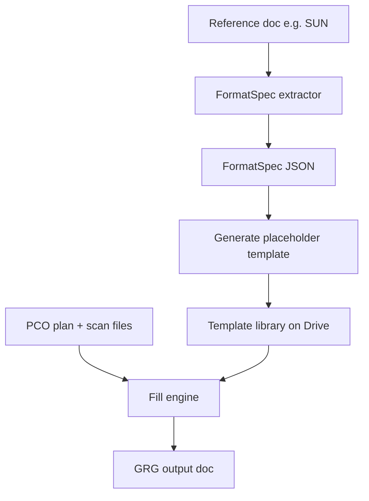

# GRG format spec (post-MVP direction)

This document describes the **target architecture** for format retention. MVP today uses a fixed Google Doc template with literal placeholders and scan import heuristics ([`GRG-TEMPLATE.md`](./GRG-TEMPLATE.md), [`GRG-SCAN-FORMAT.md`](./GRG-SCAN-FORMAT.md)).

## Goal

Planning Buddy should **fill content without destroying layout**. PCO and Drive supply data; the template supplies typography, columns, and section structure.

## Spec categories

| Category | Examples |
|----------|----------|
| **Meta** | File type, doc title pattern, date tag |
| **Layout** | Page breaks, alignment, margins, column count (intro single-column; scan header single-column; lyrics two-column) |
| **Tagging** | Roster blocks (BAND / CHOIR), song list, song title, credits, verse/chorus labels |
| **Font** | Family, size, bold/italic, caps, foreground/background color |

## Setup phase (post-MVP)

1. User uploads or points to a **reference document** (e.g. [`downloads/Get Ready Guide (SUN).docx`](../downloads/Get%20Ready%20Guide%20(SUN).docx)).
2. Extractor reads structure + run-level styles into `FormatSpec` JSON.
3. Generator produces a **template** with placeholders in the correct styles (or updates an existing template in a library).
4. User may edit the template manually or upload a new reference to replace or add a library entry.

## Execution phase (post-MVP)

1. Load template from library.
2. Replace tagged regions with PCO/Drive content **using Docs API style-aware insertion** (not plain `insertText` for styled regions).
3. Scans: continue header/lyrics split and two-column lyrics ([`src/lib/docs/scan-import.ts`](../src/lib/docs/scan-import.ts) `styled` mode); extend to match template paragraph styles.

**MVP today:** intro roster uses plain text replacement in roster blocks; scans use styled import when source is a Google Doc.

## Fail-case ladder

| Situation | MVP | Post-MVP |
|-----------|-----|----------|
| Data exists, template placeholder missing | Notify user; **Cancel** or **Skip intro** (intro markers only); block scans if `{{GRG_SCANS_BEGIN}}` missing | Diff reference vs template; suggest placeholder repairs |
| Roster section header but no roster slot line | Warning; section may not update | Infer slot from reference layout |
| User deletes/edits placeholder text | Same as missing marker | Automated reconciliation against golden reference |

## Related files

- Template contract: [`GRG-TEMPLATE.md`](./GRG-TEMPLATE.md)
- Scan layout rules: [`GRG-SCAN-FORMAT.md`](./GRG-SCAN-FORMAT.md)
- Roster consolidation: [`src/lib/docs/grg-roster-consolidate.ts`](../src/lib/docs/grg-roster-consolidate.ts)
- Project status: [`PROJECT-STATUS.md`](./PROJECT-STATUS.md)
