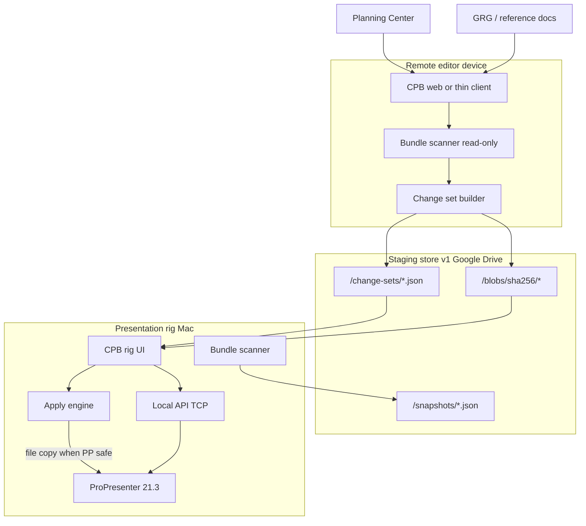

# ProPresenter sync system — architecture

**Status:** Approved for Phase 1–2 implementation planning  
**Date:** 2026-06-01  
**Related:** [PROPRESENTER-SYNC.md](./PROPRESENTER-SYNC.md) (product boundaries), [PROPRESENTER-MVP.md](./PROPRESENTER-MVP.md) (generation track), [technical research](../_bmad-output/planning-artifacts/research/technical-propresenter-sync-file-format-research-2026-06-01.md)

---

## 1. Problem and north star

**Problem:** External Google Drive mirrors the entire ProPresenter bundle across rigs. Startup sync can overwrite the live library with empty defaults.

**North star:** CPB stages **scoped change sets** (never whole-filebase sync). Remote devices **push/stage**; the **presentation rig** is the only **pull/apply** authority, with classification, signoff, restore points, and audit logs.

---

## 2. Two tracks in one repo (do not conflate)

| Track | Code home | “Manifest” means |
|-------|-----------|------------------|
| **Generation MVP** | `src/lib/slide-deck/`, `src/app/api/slide-deck/manifest/` | PCO + GRG → **service playlist intent** (dry-run before API write) |
| **Sync replacement** | `src/lib/propresenter/bundle-sync/` (new) | Filebase **snapshot** → diff → **change set** → staged blobs |

Shared: `src/lib/propresenter/client.ts`, `safety.ts`, config, Local API reads.  
**Sequencing decision:** Finish generation **PR1** (service manifest dry-run) first; start sync **Phase 1** as `bundle-sync/` without overloading slide-deck routes. See [PROPRESENTER-SYNC-SEQUENCING.md](./planning/PROPRESENTER-SYNC-SEQUENCING.md).

---

## 3. System context



---

## 4. Core components

### 4.1 Bundle scanner (`bundle-sync/scanner.ts`)

- Input: configurable bundle root (`PP_BUNDLE_ROOT`, default from ProPresenter Support Files path)
- Walk: `Libraries/**`, `Playlists/**`, media roots referenced in manifest (Phase 1: media paths recorded, not all files walked)
- Exclude: `Configuration/**`, caches, logs, `*.tmp`, index rebuild dirs (per research doc)
- Output: `BundleSnapshot` JSON — files with `relativePath`, `size`, `mtime`, `sha256`, optional `ppUuid` from sidecar/API

### 4.2 Snapshot store (`bundle-sync/snapshots.ts`)

- Rig-local: `~/.cpb/propresenter/snapshots/{id}.json`
- Cloud copy (optional Phase 2): Drive folder per church account (reuse Google OAuth from GRG)
- Immutable once written; `baseSnapshotId` on change sets references these

### 4.3 Diff engine (`bundle-sync/diff.ts`)

- Compare snapshot A → B → list of `SyncChange` entries
- Phase 2 classifier (`bundle-sync/classify.ts`):
  - **simple:** playlist order/membership only (API-verified when possible)
  - **non_destructive:** file_add, playlist_create, LIVE-scoped updates (hash changed, path rules)
  - **destructive:** file_delete, Master-protected paths, config touches
  - **conflict:** base snapshot stale vs rig current
- Phase 4: plug in `PresentationContentFingerprint` from protobuf decode (see research go/no-go)

### 4.4 Change set (`bundle-sync/types.ts`)

Align with context doc:

```ts
type SyncChangeSet = {
  id: string;
  serviceDate: string;
  author: string;
  createdAt: string;
  sourceDevice: string;
  baseSnapshotId: string;
  changes: SyncChange[];
  classification: "simple" | "non_destructive" | "destructive" | "conflict";
  pushApproval?: Approval;
  pullApproval?: Approval;
};
```

Cloud layout:

```text
/change-sets/{serviceDate}-{id}.json
/blobs/sha256/{hash}.{ext}
/snapshots/rig-main-{iso-date}.json
```

### 4.5 Staging client (`bundle-sync/stage.ts`)

- Upload change set + referenced blobs (content-addressed dedup)
- Never upload full bundle tree
- Push signoff: store `pushApproval` on change set record

### 4.6 Rig apply engine (`bundle-sync/apply.ts`)

**Preconditions:** live lock not `Live` (or emergency override); dry-run pass; pull approval recorded

**Steps:**

1. Create restore point (copy affected paths + playlist state snapshot)
2. Ensure ProPresenter quit or documented safe window
3. Apply changes in order: additive → simple playlist (API) → file copies
4. Write audit log entry
5. Post-apply: optional `pp:probe` / enumeration sanity check

**Never:** `v1/libraries` or `v1/library/` writes (existing `safety.ts`); whole-directory mirror

### 4.7 Session / live lock (`bundle-sync/session.ts`)

Replaces WhatsApp/CLI warning:

```text
Status: Presentation Rig In Use
Held by: {operator}
Mode: Editing | Rehearsal | Live
Remote apply: blocked | stage-only
```

Operators: `operators.json` on rig (local v1)

### 4.8 Audit log (`bundle-sync/audit.ts`)

Append-only JSONL or SQLite on rig:

```text
changeSetId, classification, stagedBy, pushApprovedBy, pullApprovedBy,
devices, timestamps, filesChanged[], beforeSnapshotId, afterSnapshotId
```

---

## 5. Integration with existing CPB modules

| Existing module | Sync interaction |
|-----------------|------------------|
| `src/lib/propresenter/client.ts` | Playlist apply for **simple** changes; enumeration for UUID/hash correlation |
| `src/lib/propresenter/safety.ts` | Extend with `bundle-sync` path allowlist for file writes (separate from API allowlist) |
| `src/lib/propresenter/library-read.ts` | Enrich manifest with API metadata where file hash alone insufficient |
| `src/lib/slide-deck/manifest.ts` | **No merge** — generation manifest stays PCO/service-order only |
| Google Drive OAuth | Reuse for cloud staging folder (v1); Supabase deferred |
| Wizard signoff pattern (`src/app/grg/`) | Reuse UX patterns for push/pull modals in Phase 2 |

---

## 6. Safety model (architecture rules)

1. **No whole-bundle sync** — hard reject in `stage.ts` if change count or byte threshold implies full mirror
2. **Rig-only pull apply** — remote clients cannot call `apply` routes (device attestation: local host + rig token v1)
3. **Restore point before every apply** — including “non-destructive”
4. **Unknown classification → conflict** — no silent apply
5. **Master / lyrics / actions** — destructive until Phase 4 semantic proof
6. **API library writes remain blocked** — file copy is explicit, allowlisted paths only

---

## 7. Deployment topology (v1)

| Runtime | Role |
|---------|------|
| CPB Next.js (existing) | UI, OAuth, change-set CRUD, cloud blob upload |
| Rig-local CLI or menu bar helper (Phase 1+) | Bundle scan + apply when PP paths not visible to cloud host |
| ProPresenter on rig | Target of file copy + API playlist ops |

**Note:** If CPB dev server runs on same Mac as PP, scanner can use `PP_BUNDLE_ROOT` directly. Remote editors use browser-only staging against cloud change sets built from **their** local scan export (upload manifest + blobs).

---

## 8. Phase mapping

| Phase | Architecture deliverables |
|-------|---------------------------|
| **1** | `scanner`, `snapshots`, CLI `pp:bundle-scan`, rig snapshot store |
| **2** | `diff`, `classify`, audit schema, push/pull UI, cloud change-set folders |
| **3** | `stage`, `apply` additive + simple only, restore points |
| **4** | protobuf fingerprint module, safe overwrite branch in `apply` |
| **5** | destructive UI, archive workflow separation |

---

## 9. Open technical decisions (post-research)

| ID | Decision | Default |
|----|----------|---------|
| D1 | Cloud staging backend | Google Drive (church folder) v1 |
| D2 | Rig helper vs pure web scan | CLI on rig for Phase 1 |
| D3 | Semantic decode library | `protobufjs` + vendored ProPresenter7-Proto Phase 4 |
| D4 | Bundle size limits per change set | 500 MB staged blobs without extra approval |

---

## 10. References

- Context: `docs/user-feedback/context-convos/ProPresenter-sync-system-context-2026.06.01.md`
- Research: `_bmad-output/planning-artifacts/research/technical-propresenter-sync-file-format-research-2026-06-01.md`
- Epics: `docs/planning/PROPRESENTER-SYNC-EPICS-PHASE-1-2.md`
