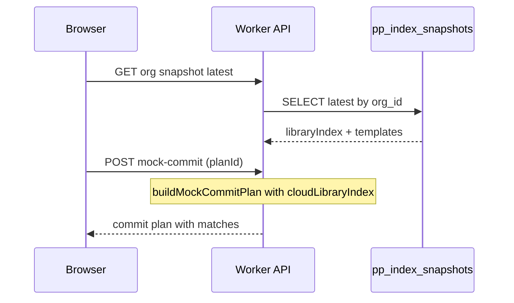

# Slide Deck platform — Phase 0 specification

**Status:** Approved  
**Duration:** Weeks 1–2  
**Epics:** PLATFORM-0.1 – PLATFORM-0.5 in [SLIDE-DECK-PLATFORM-EPICS.md](./SLIDE-DECK-PLATFORM-EPICS.md)

---

## Objective

Enable **accurate browser-based commit preview** using an **org-scoped ProPresenter index** uploaded from the presentation rig — without requiring ProPresenter on the planner's machine.

**Exit criteria:** Pilot church planner previews June-style plan with library matches visible; queues build to `slide_deck_builds`; rig apply still via debug CLI until Phase 1.

---

## 1. Database schema

### Migration: `20260608120000_slide_deck_platform.sql`

#### `pp_rigs`

| Column | Type | Notes |
|--------|------|-------|
| `id` | uuid PK | |
| `org_id` | uuid FK → organizations | |
| `display_name` | text | e.g. "Main sanctuary Mac" |
| `device_fingerprint` | text | Hardware UUID hash |
| `public_key` | text | Ed25519 public key (base64) |
| `status` | text | `active`, `revoked` |
| `last_seen_at` | timestamptz | Updated on each authenticated request |
| `created_at` | timestamptz | |
| `paired_by` | uuid FK → auth.users | Admin who paired |

#### `pp_index_snapshots`

| Column | Type | Notes |
|--------|------|-------|
| `id` | uuid PK | |
| `org_id` | uuid FK | Denormalized for RLS |
| `rig_id` | uuid FK → pp_rigs | |
| `snapshot_at` | timestamptz | |
| `schema_version` | int | `1` |
| `index_json` | jsonb | Full `BundleSnapshot` + derived library index |
| `delta_from_snapshot_id` | uuid nullable | Optional chain |
| `file_count` | int | Summary stat |
| `created_at` | timestamptz | |

Index: `(org_id, snapshot_at DESC)`

#### `slide_deck_builds`

| Column | Type | Notes |
|--------|------|-------|
| `id` | uuid PK | |
| `org_id` | uuid FK | Required on all builds |
| `rig_id` | uuid FK nullable | Target rig; null = any rig in org |
| `created_by` | uuid FK → auth.users | |
| `plan_id` | text | PCO plan ID |
| `service_type_id` | text nullable | |
| `status` | text | `pending`, `claimed`, `applying`, `completed`, `failed`, `rejected` |
| `commit_plan` | jsonb | `MockCommitPlan` |
| `library_selections` | jsonb | |
| `change_summary` | text | One-line for rig UI ("Sally UX") |
| `publish_after_apply` | boolean | default true |
| `base_snapshot_id` | uuid FK nullable | Index used at queue time |
| `result` | jsonb nullable | Apply + publish output |
| `error_message` | text nullable | |
| `claimed_at` | timestamptz nullable | |
| `completed_at` | timestamptz nullable | |
| `created_at` | timestamptz | |

#### `org_members` role extension

Add `operator` to role check: `admin`, `planner`, `viewer`, `operator`.

#### Deprecation note

`slide_deck_jobs` retained for debug; new writes go to `slide_deck_builds`.

---

## 2. Bundle scanner (`src/lib/propresenter/bundle-sync/`)

### Files

| File | Purpose |
|------|---------|
| `types.ts` | `BundleSnapshot`, `BundleFileRecord`, `BundleLibraryIndex` |
| `config.ts` | `PP_BUNDLE_ROOT` resolution |
| `scanner.ts` | Read-only walk Libraries + Playlists |
| `library-index.ts` | Derive `PpLibraryItemRef[]` from snapshot for matcher |

### `BundleSnapshot` shape (schemaVersion 1)

```ts
type BundleSnapshot = {
  schemaVersion: 1;
  createdAt: string;
  bundleRoot: string;
  deviceLabel: string;
  files: Array<{
    relativePath: string;
    size: number;
    mtimeMs: number;
    sha256?: string;
  }>;
  libraryIndex?: PpLibraryItemRef[];  // populated when PP API available during scan
  templatePlaylists?: Array<{ name: string; id?: string; itemCount: number }>;
};
```

### CLI

```bash
npm run pp:bundle-scan              # summary
npm run pp:bundle-scan -- --json    # stdout JSON
npm run pp:bundle-scan -- --save main-rig
```

Script: `scripts/pp-bundle-scan.ts`

### Scanner behavior (stub → full)

Phase 0 stub:

- Validates `PP_BUNDLE_ROOT` exists
- Walks `Libraries/**` and `Playlists/**` (max depth 12)
- Skips `Configuration/**`, `*.tmp`, `.DS_Store`
- Records path, size, mtime (sha256 optional in stub)
- Does **not** write to ProPresenter

Phase 0.5 enhancement: optional PP API pass during scan to populate `libraryIndex` when PP running locally.

---

## 3. Index upload API

### `POST /api/pp/rigs/{rigId}/snapshots`

**Auth:** Rig signature (Phase 0 may accept `SLIDE_DECK_AGENT_TOKEN` for bootstrap; remove before Phase 1 pilot).

**Body:**

```json
{
  "snapshot": { /* BundleSnapshot */ },
  "deltaFromSnapshotId": "uuid-or-null"
}
```

**Response:** `{ ok: true, snapshotId, snapshotAt }`

### `GET /api/pp/orgs/{orgId}/snapshots/latest`

**Auth:** User session + `is_org_member(orgId)`

**Response:**

```json
{
  "ok": true,
  "snapshot": {
    "id": "...",
    "snapshotAt": "...",
    "rigName": "Main sanctuary Mac",
    "stale": false,
    "libraryIndex": [ /* PpLibraryItemRef[] */ ],
    "templatePlaylists": [ /* ... */ ]
  }
}
```

`stale: true` when `snapshotAt` &gt; 7 days ago.

### Server modules

- `src/lib/pp-platform/rigs.ts` — CRUD, pairing
- `src/lib/pp-platform/snapshots.ts` — insert, latest query
- `src/lib/pp-platform/rig-auth.ts` — signature verification

---

## 4. Web preview from cached index

### Flow



### Code changes

| File | Change |
|------|--------|
| `src/lib/slide-deck/mock-commit.ts` | Extend `BuildMockCommitInput` with optional `cloudLibraryIndex`, `cloudTemplateItems`, `indexSnapshotId` |
| `src/app/api/slide-deck/mock-commit/route.ts` | Fetch latest org snapshot when hosted; pass to builder |
| `src/app/slide-deck/page.tsx` | Show index freshness banner; pass org context |
| `src/components/slide-deck-hosted-panel.tsx` | Primary CTA → queue `slide_deck_builds` |

### Warning changes

Replace generic "ProPresenter not connected" with:

- *"Using library index from {rigName}, updated {relative time}."* (green)
- *"Index is {N} days old — ask operator to open Grapevine Rig."* (amber)

---

## 5. Build queue API

### `POST /api/pp/builds`

**Auth:** User session; requires `planner` or `admin` in org.

**Body:**

```json
{
  "orgId": "uuid",
  "rigId": "uuid-or-null",
  "planId": "89003853",
  "serviceTypeId": "309883",
  "commitPlan": { /* MockCommitPlan */ },
  "librarySelections": {},
  "changeSummary": "Sunday June 14 — 5 songs",
  "publishAfterApply": true
}
```

Stores `base_snapshot_id` from latest org snapshot at queue time.

### `GET /api/pp/builds?orgId=...`

Lists recent builds for status polling (replaces user-only agent jobs list in UI).

---

## 6. Environment variables

Add to `.env.local.example`:

```bash
# ProPresenter bundle scanner (rig)
PP_BUNDLE_ROOT=   # e.g. ~/Library/Application Support/ProPresenter/...

# Phase 0 bootstrap only (deprecated for production)
SLIDE_DECK_AGENT_TOKEN=
```

---

## 7. Testing checklist

- [ ] Migration applies cleanly on Supabase
- [ ] `npm run pp:bundle-scan` on operator Mac returns file count &gt; 0
- [ ] Snapshot upload via API (curl or bootstrap script)
- [ ] Hosted mock-commit shows library match for known song
- [ ] Queue build → row in `slide_deck_builds` with correct `org_id`
- [ ] Stale index banner when `snapshot_at` backdated

---

## 8. Out of scope (Phase 0)

- Tauri rig client (Phase 1)
- Rig signature auth production hardening (bootstrap token OK for dev)
- Org switcher UI (single org hardcoded or session default)
- FSEvents watch
- Change sets / remote file pull
