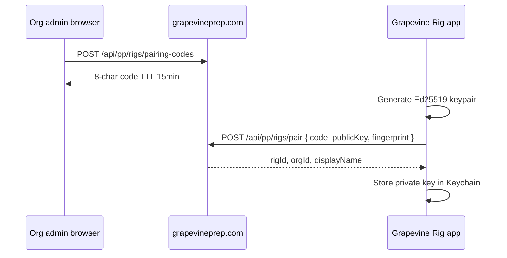

# Slide Deck platform — Phase 1 specification

**Status:** Approved  
**Duration:** Weeks 3–4  
**Prerequisites:** Phase 0 complete + 1 pilot Sunday with queued builds  
**Epics:** PLATFORM-1.1 – PLATFORM-1.5 in [SLIDE-DECK-PLATFORM-EPICS.md](./SLIDE-DECK-PLATFORM-EPICS.md)

---

## Objective

Ship **Grapevine Rig** — a downloadable Mac app that replaces `npm run slide-deck:agent` for operators. One-click apply of pending builds; automatic index sync.

**Exit criteria:** Pilot church runs 3 consecutive Sundays with web queue + Grapevine Rig apply only; zero terminal use.

---

## 1. Application: Grapevine Rig

### Stack decision (party)

| Layer | Choice | Rationale |
|-------|--------|-----------|
| Shell | **Tauri 2** | Smaller than Electron; ships `.dmg`; Rust for Keychain + FS watch |
| UI | React or vanilla TS panel | Reuse status/step patterns from slide-deck page |
| Apply logic | Bundled TS from `src/lib/slide-deck/` | Same code path as `runSlideDeckAgentJob` |
| PP communication | Local TCP API (existing `ppRequest`) | ProPresenter must run on same Mac |

### Project layout

```
church-planning-buddy/
  apps/grapevine-rig/
    src-tauri/          # Rust: Keychain, FSEvents, launch at login
    src/                # Status UI, pairing wizard, apply button
    tauri.conf.json
  src/lib/slide-deck/   # Shared apply logic (imported or copied at build)
```

### Distribution

- Signed + notarized `.dmg` (Apple Developer ID)
- Version pinned to grapevineprep.com API version
- Auto-update: Phase 1 stretch; manual reinstall OK for pilot

---

## 2. Pairing flow (PLATFORM-1.1)



### Web UI (org settings)

- **Add presentation rig** → shows code + QR
- Lists paired rigs: name, last seen, revoke button

### Rig first-run wizard

1. Welcome + "Enter pairing code from your admin"
2. Validate code → store credentials
3. Optional: set display name
4. Run first index scan

---

## 3. Rig client UI (Sally spec)

### Main window (400×320 px default)

```
┌─────────────────────────────────────┐
│ ● Build ready          Grapevine Rig │
├─────────────────────────────────────┤
│                                     │
│     [ Apply Slide Deck ]            │  ← full width, primary
│                                     │
│  ▶ What changed?                    │  ← collapsed
│    "Sunday June 14 — 5 songs"       │
│                                     │
│  Index: synced 2 hours ago          │
│  [ Scan now ]                       │
└─────────────────────────────────────┘
```

### Status states

| State | Badge | Button |
|-------|-------|--------|
| Up to date | Green | Grayed "No pending updates" |
| Build ready | Amber pulse | **Apply Slide Deck** |
| Applying | Spinner | Disabled |
| Error | Red | "Retry" + error message |

### Menu bar mode

- Tray icon shows badge count of pending builds
- Click tray → popover with same Apply button
- "Open main window" in menu

---

## 4. Index sync (PLATFORM-1.3)

| Trigger | Action |
|---------|--------|
| App launch | Scan if last scan &gt; 24h |
| Daily 3 AM local | Background scan |
| FSEvents debounce 30s | Delta scan (best effort) |
| "Scan now" button | Full scan |

Upload via Phase 0 `POST /api/pp/rigs/{rigId}/snapshots` with rig signature.

---

## 5. Apply engine (PLATFORM-1.4)

### Poll loop

```
every 5s:
  GET /api/pp/rigs/{rigId}/builds/pending
  if build:
    validate base_snapshot_id vs local index freshness
    run applyCommitPlan + optional publishSlideDeckPackage
    PATCH build status + result
```

### Code reuse

| Existing module | Rig client usage |
|-----------------|------------------|
| [`runSlideDeckAgentJob`](church-planning-buddy/src/lib/slide-deck/run-agent-job.ts) | Core job runner — extract to shared package |
| [`applyCommitPlan`](church-planning-buddy/src/lib/slide-deck/apply-commit.ts) | PP playlist writes |
| [`publishSlideDeckPackage`](church-planning-buddy/src/lib/slide-deck/publish.ts) | Drive handoff |
| Google tokens | Load from Supabase for `created_by` user via service API |

### Rig-side Google tokens

Rig client requests short-lived apply token:

`POST /api/pp/rigs/{rigId}/apply-token` (rig auth) → scoped token for Drive publish using org's connected Google account (admin-configured default or build author's tokens).

### Validation before apply

- Reject if `commit_plan.playlistConflict` unresolved
- Reject if base snapshot &gt; 7 days older than rig's current index (warn operator)
- Reject if ProPresenter not reachable

---

## 6. Web UI updates (Phase 1)

| Change | Detail |
|--------|--------|
| Primary CTA | **Send to presentation rig** → `POST /api/pp/builds` |
| Status | Live poll with spinner on "Refresh" |
| Rig selector | Dropdown if org has multiple rigs |
| Remove prominence | Options A/B CLI collapsed |
| Success | "Build ready on {rig name}" with timestamp |

---

## 7. ProPresenter startup prompt (PLATFORM-1.5 stretch)

### Detection options

1. **NSWorkspace** observe `com.renewedvision.ProPresenter` launch (Tauri Rust side)
2. Fallback: rig client shows modal on next focus if PP launched while build pending

### Modal copy

> A new slide deck is ready. Apply now?  
> [ Apply ]  [ Skip for now ]

Skip does not dismiss build — remains in queue.

---

## 8. Security (production)

- Remove `SLIDE_DECK_AGENT_TOKEN` from operator documentation
- All rig API calls require Ed25519 signature
- Revoked rigs cannot claim builds
- Audit log: `pp_build_events` table (optional Phase 1 stretch)

---

## 9. Migration from interim agent

| Interim | Phase 1 |
|---------|---------|
| `npm run slide-deck:agent` | Grapevine Rig app |
| `slide_deck_jobs` table | `slide_deck_builds` |
| Shared bearer token | Per-rig keypair |
| `GET /api/slide-deck/agent/jobs` | `GET /api/pp/rigs/{rigId}/builds/pending` |

Keep agent script for CI/debug per [SLIDE-DECK-DEPRECATION.md](../SLIDE-DECK-DEPRECATION.md).

---

## 10. Testing checklist

- [ ] Pair rig via admin code
- [ ] Index upload from rig app
- [ ] Web queue build → rig shows "Build ready"
- [ ] Apply → ProPresenter playlist created
- [ ] Publish → Drive folder link in web status
- [ ] Revoked rig cannot claim
- [ ] Pilot operator completes flow without Terminal

---

## 11. Out of scope (Phase 1)

- Remote editor file pull/push (Phase 2)
- Windows client
- In-app auto-update
- Full conflict classifier UI
- Multi-org switcher (if not done in Phase 0.5)
