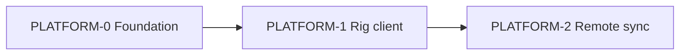

# Slide Deck platform — Epics & stories

**Date:** 2026-06-07  
**Prerequisites:** Party [`party-2026-06-07-slide-deck-platform.md`](../party/output/party-2026-06-07-slide-deck-platform.md), [SLIDE-DECK-PLATFORM-PRD-ADDENDUM.md](./SLIDE-DECK-PLATFORM-PRD-ADDENDUM.md)  
**Phases:** [SLIDE-DECK-PHASE-0-SPEC.md](./SLIDE-DECK-PHASE-0-SPEC.md), [SLIDE-DECK-PHASE-1-SPEC.md](./SLIDE-DECK-PHASE-1-SPEC.md)

---

## Security model (cross-cutting)

### Per-rig device credentials

| Concern | Approach |
|---------|----------|
| Identity | `pp_rigs.id` + Ed25519 public key registered at pairing |
| Secret storage | Private key in macOS Keychain only |
| Pairing | Org admin generates 8-char code (15 min TTL) → rig exchanges for rig JWT |
| API auth | `Authorization: Rig {rig_id}:{base64_signature}` over canonical request body hash |
| Rotation | Admin can revoke rig → re-pair generates new keypair |
| Debug fallback | `SLIDE_DECK_AGENT_TOKEN` bearer — **deprecated**, dev/CI only |

### Authorization matrix

| Action | Web (user session) | Rig client |
|--------|-------------------|------------|
| Upload index snapshot | — | Rig sig + `rig.org_id` |
| Queue build | `planner`/`admin` in org | — |
| Claim build | — | Rig sig + build.`org_id` = rig.`org_id` |
| List builds | Own org via RLS | Own rig's org builds |
| Pair rig | `admin` in org | Pairing code + new keypair |

### RLS policies (summary)

- `pp_rigs`: select if `org_id IN user_org_ids()`; insert/update admin only
- `pp_index_snapshots`: select if `org_id IN user_org_ids()`; insert via service role or rig-authenticated edge function
- `slide_deck_builds`: select/insert if `org_id IN user_org_ids()`; update status via rig auth path

---

## Epic PLATFORM-0: Foundation (Phase 0, weeks 1–2)

**User value:** Planners preview accurate commit plans in the browser without ProPresenter open on their machine.

### Story PLATFORM-0.1 — Schema migration

**As** a platform engineer  
**I want** org- and rig-scoped tables  
**So that** builds and indexes are tenant-isolated

**Acceptance criteria:**

- [ ] Migration creates `pp_rigs`, `pp_index_snapshots`, `slide_deck_builds`
- [ ] `slide_deck_builds` includes `org_id`, `rig_id`, `created_by`, `commit_plan`, `status`
- [ ] RLS enabled with policies per security model above
- [ ] `org_members` adds `operator` role
- [ ] `slide_deck_jobs` marked deprecated in migration comment (retain for debug)

**Technical notes:** `supabase/migrations/20260608120000_slide_deck_platform.sql`

---

### Story PLATFORM-0.2 — Bundle scanner stub

**As** a rig operator  
**I want** a read-only scan of my ProPresenter library tree  
**So that** the cloud index reflects my rig

**Acceptance criteria:**

- [ ] `src/lib/propresenter/bundle-sync/scanner.ts` walks Libraries + Playlists
- [ ] Returns `BundleSnapshot` with `schemaVersion: 1`
- [ ] CLI `npm run pp:bundle-scan` prints summary or `--json`
- [ ] Unit test with fixture tree

**Technical notes:** Align with [PROPRESENTER-SYNC-EPICS-PHASE-1-2.md](./PROPRESENTER-SYNC-EPICS-PHASE-1-2.md) SYNC-1.2

---

### Story PLATFORM-0.3 — Index upload API

**As** a rig client  
**I want** to POST index snapshots to the cloud  
**So that** web previews use my library

**Acceptance criteria:**

- [ ] `POST /api/pp/rigs/{rigId}/snapshots` accepts `index_json`, verifies rig signature
- [ ] `GET /api/pp/orgs/{orgId}/snapshots/latest` returns newest snapshot metadata + library index subset for matching
- [ ] Web shows "last synced" timestamp and rig name

---

### Story PLATFORM-0.4 — Web preview from cached index

**As** a remote planner  
**I want** library matches in commit preview without local ProPresenter  
**So that** I can validate the plan before Sunday

**Acceptance criteria:**

- [ ] `buildMockCommitPlan` accepts `cloudLibraryIndex` + `cloudTemplateItems` when `propresenterConnected: false`
- [ ] Hosted slide-deck page fetches latest org snapshot before mock-commit
- [ ] Preview shows match confidence or NEEDS_ARRANGEMENT flags from index
- [ ] Stale index (&gt; 7 days) shows amber banner

---

### Story PLATFORM-0.5 — Web UX: Send to rig (queue only)

**As** a planner  
**I want** one button to queue a build  
**So that** I don't need terminal instructions

**Acceptance criteria:**

- [ ] Primary CTA **Send to presentation rig** inserts `slide_deck_builds` row
- [ ] Loading states: Queuing → Queued (with rig name if assigned)
- [ ] Options A/B collapsed under "Advanced / troubleshooting"
- [ ] Auto-poll build status every 8s with visible refresh indicator

---

## Epic PLATFORM-1: Rig client (Phase 1, weeks 3–4)

**User value:** Rig operator applies queued builds with one click — no terminal.

### Story PLATFORM-1.1 — Rig pairing flow

**As** an org admin  
**I want** to pair a Mac to my church  
**So that** only our rig receives our builds

**Acceptance criteria:**

- [ ] Admin UI generates pairing code
- [ ] Rig client first-run: enter code → register keypair → store credentials
- [ ] Paired rig appears in org settings with last seen

---

### Story PLATFORM-1.2 — Tauri rig client shell

**As** a rig operator  
**I want** a downloadable Mac app  
**So that** I never use Terminal

**Acceptance criteria:**

- [ ] `apps/grapevine-rig/` Tauri 2 project builds signed `.dmg`
- [ ] Small persistent window per Sally UX spec
- [ ] Minimize to menu bar optional
- [ ] Login Items / launch at startup documented

---

### Story PLATFORM-1.3 — Index sync in rig client

**As** a rig operator  
**I want** the app to keep the cloud index current  
**So that** remote planners see accurate previews

**Acceptance criteria:**

- [ ] Rig runs bundle scan on schedule (daily) and on "Scan now"
- [ ] FSEvents debounced watch (best effort in Tauri; fallback polling)
- [ ] Upload via PLATFORM-0.3 API

---

### Story PLATFORM-1.4 — Apply engine in rig client

**As** a rig operator  
**I want** one-click apply of pending builds  
**So that** Sunday prep is fast

**Acceptance criteria:**

- [ ] Rig polls `GET /api/pp/rigs/{rigId}/builds/pending`
- [ ] **Apply Slide Deck** runs `runSlideDeckAgentJob` equivalent locally
- [ ] Reports completed/failed via PATCH
- [ ] Reuses `applyCommitPlan`, `publishSlideDeckPackage` from `src/lib/slide-deck/`

---

### Story PLATFORM-1.5 — ProPresenter startup prompt (stretch)

**As** a rig operator  
**I want** a prompt when ProPresenter opens if a build is pending  
**So that** I don't forget to apply

**Acceptance criteria:**

- [ ] Detect PP launch (bundle id watch or manual trigger)
- [ ] Modal: Apply / Skip for now
- [ ] Documented as stretch — may slip to Phase 2

---

## Epic PLATFORM-2: Remote editor sync (Phase 2, weeks 5–8)

**User value:** Remote editors pull scoped files, edit in ProPresenter, push change sets for rig review.

Stories deferred to PROPRESENTER-SYNC Phase 2 epics (SYNC-2.x) with platform integration points documented in Phase 2 spec addendum (future).

---

## Deprecation epic

### Story PLATFORM-DEP-1 — Deprecate interim agent UX

See [SLIDE-DECK-DEPRECATION.md](../SLIDE-DECK-DEPRECATION.md).

---

## Sequencing diagram

**Gate:** Pilot church completes 1 Sunday with PLATFORM-0 queue + manual CLI apply before PLATFORM-1 ships; 3 Sundays with rig client before PLATFORM-2 starts.
