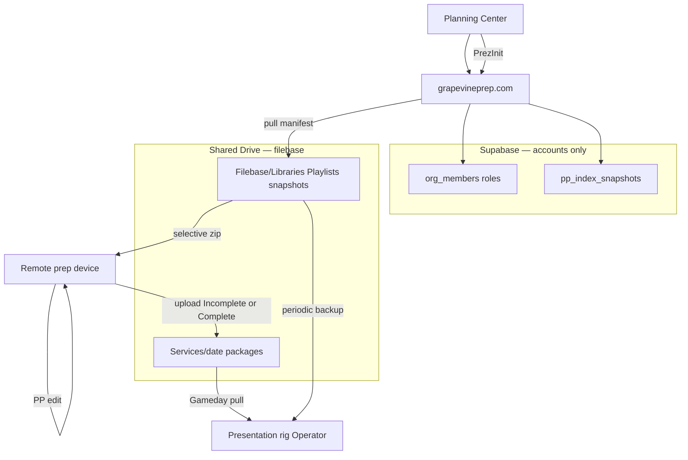

# Grapevine filebase architecture

**Status:** Approved (2026-06-15)  
**Source:** [user feedback vision](../user-feedback/context-convos/2026-15-06-14.43.md), party-mode gap analysis, [PROPRESENTER-SYNC.md](../PROPRESENTER-SYNC.md)  
**Extends:** [multi-user-ops-and-shared-drive.md](./multi-user-ops-and-shared-drive.md), [SLIDE-DECK-PLATFORM-PRD-ADDENDUM.md](./SLIDE-DECK-PLATFORM-PRD-ADDENDUM.md)

Use this doc when standing up the Shared Drive filebase, onboarding volunteers for remote prep, or implementing selective pull / Gameday package delivery in code.

---

## Goal (one sentence)

Host the church **ProPresenter filebase** on Google Shared Drive so remote volunteers can **pull only what a given week's plan needs**, upload finished presentations with clear **Incomplete / Complete** status, and let the **presentation rig Operator** pull a verified **`.proplaylist` + dependencies** package on Gameday — **without** whole-filebase mirror sync between machines.

---

## Terminology

| Term | Meaning | Where |
|------|---------|-------|
| **Filebase** | ProPresenter Libraries, Playlists, templates, media — everything that composes a presentation | GDrive `Filebase/` (working copy) + rig local backup |
| **Service package** | One week's presentation handoff (playlist + deps + JSON markers) | GDrive `Services/{YYYY.MM.DD}/` |
| **Supabase** | Accounts, org roles, optional build queue, library index snapshots | Not the filebase |
| **Remote device** | Any prep machine with internet + ProPresenter (not the presentation rig) | Volunteer laptops, dedicated prep PC |
| **Presentation rig** | Machine that presents during service | Sanctuary Mac/PC + Grapevine Rig + **Operator** login |
| **Browser planner** | grapevineprep.com `/slide-deck` — PCO preview/submit without local PP | Separate lane from remote PP editing |

---

## Anti-goals (non-negotiable)

These caused past production failures ([ProPresenter sync context](../user-feedback/context-convos/ProPresenter-sync-system-context-2026.06.01.md)):

1. **No whole-filebase mirror sync** between devices (startup overwrite, blank defaults wiping the library).
2. **No silent overwrite** of rig local files on Gameday pull — Operator always confirms conflicts.
3. **No filebase-only-on-rig** as the sole source — remote prep must reach GDrive without someone at the sanctuary machine.
4. **No auto-promotion** of Incomplete uploads to Gameday.

Aligns with [PROPRESENTER-SYNC.md](../PROPRESENTER-SYNC.md): scoped change sets, rig as apply authority, signoff on push and pull.

---

## System context



**Two tracks in code** ([PROPRESENTER-SYNC-ARCHITECTURE.md](../PROPRESENTER-SYNC-ARCHITECTURE.md)):

| Track | Module | Role |
|-------|--------|------|
| Generation (PrezInit) | `src/lib/slide-deck/` | PCO → manifest → commit plan |
| Filebase / sync | `src/lib/propresenter/bundle-sync/` | Snapshot, sha256 index, change sets |
| GDrive layout | `src/lib/google/pp-drive-folders.ts` | Folder resolution (extend for `Filebase/`) |
| Package envelope | `src/lib/slide-deck/publish-instructions.ts`, `publish-types.ts` | `import-marker.json`, `PublishedFileRef` |

---

## Shared Drive folder tree

One Shared drive per church (e.g. `Saddleback Berlin — Grapevine`). Extends [multi-user-ops layout](./multi-user-ops-and-shared-drive.md):

```text
Shared drive: {Church} — Grapevine
├── Filebase/                              ← working ProPresenter filebase (canonical on Drive)
│   ├── Libraries/                         ← mirrors PP Libraries/** under Support Files
│   ├── Playlists/                         ← master playlists (not weekly exports only)
│   └── snapshots/                         ← BundleSnapshot JSON (metadata + sha256 index only)
├── Services/                              ← weekly presentation packages
│   └── {YYYY.MM.DD}/
│       ├── working-v1/                    ← Incomplete uploads
│       ├── working-v2/
│       ├── complete-v1/                   ← Complete uploads
│       ├── complete-v2/
│       └── final/                         ← admin-promoted or latest Complete for Gameday
│           ├── import-marker.json
│           ├── manifest.json
│           ├── build-report.json
│           ├── {playlist-name}.proplaylist
│           └── media/ …                   ← resolved dependencies for this package
├── Get Ready Guide/
│   ├── Template/
│   └── Output/
└── Song Scans/
```

### Service package files

Each package folder contains at minimum:

| File | Purpose |
|------|---------|
| `import-marker.json` | Package id, plan id, `submission_status`, `files[]` with `path`, `sha256`, `driveFileId` |
| `manifest.json` | PCO-driven service intent (from slide-deck manifest) |
| `build-report.json` | Human-readable apply/preview summary |
| `*.proplaylist` | ProPresenter native playlist export |
| `media/**` | All library/media deps required to run the playlist |

Schema: `src/lib/slide-deck/publish-types.ts` (`SlideDeckImportMarker`, `PublishedFileRef`).

---

## Roles and permissions

| Vision role | Supabase `org_members.role` | Where used | Key capabilities |
|-------------|----------------------------|------------|------------------|
| **Owner** | `owner` (new) | Org head account(s) e.g. `info@church.org` | Configure filebase Drive root; member admin; min 1 owner; self-remove only if another owner remains; cannot be removed by another owner |
| **Admin** | `admin` | WD, tech director, pastors | All tools; merge at Send; pair rig; promote Complete → `final/` |
| **User** | `planner` | Remote prep volunteers | Selective pull; PP edit; upload with Incomplete/Complete prompt |
| **Viewer** | `viewer` | Read-only staff | Download packages for review |
| **Operator** | `operator` | **Presentation rig only** — dedicated sanctuary login | Gameday pull; conflict resolution; Scan now; **not** used on volunteer prep machines |

### Shared Drive membership (Google)

| Person | Drive role |
|--------|------------|
| Owners, Admins, Users (planners) | **Content manager** or **Contributor** (upload to `Services/`; add to `Filebase/Libraries/` when adding songs) |
| Viewers | **Viewer** |
| Operator rig account | **Content manager** or **Contributor** on rig machine |

Use a **Shared drive**, not personal Gmail-owned folders — avoids GRG/slide-deck 403 delete failures ([multi-user-ops](./multi-user-ops-and-shared-drive.md)).

---

## Device roles

| Device | Actor | Primary workflow |
|--------|-------|------------------|
| **Browser** (any) | Admin / User | PCO plan → preview → submit draft; optional Send-to-rig for PCO-only weeks |
| **Remote prep** (Mac/Windows + PP) | User (`planner`) | PrezInit pull → PP edit → upload Incomplete/Complete |
| **Presentation rig** | Operator (`operator`) | Gameday pull Complete/final package; conflict UI; Scan now |
| **Chromebook** | Browser lane only | No full desktop ProPresenter — use grapevineprep.com for PCO, not hands-on PP edit |

---

## Workflows

### PrezInit — no presentation on GDrive yet

1. **PCO is source of truth** — same as today: `/slide-deck` mock-commit from plan ([`mock-commit.ts`](../../src/lib/slide-deck/mock-commit.ts)).
2. Grapevine builds **JSON pull instructions** listing **exact filebase files** needed for this plan (selective only — not full library).
3. Remote device downloads transport zip from GDrive (web v1) or Grapevine client (later).
4. Volunteer assembles/opens in local ProPresenter; manual edits per planning needs.
5. Upload back to `Services/{date}/` with **Incomplete** or **Complete** prompt.

**Block if:** song missing from filebase index — same fail-fast as [new-song-entry-workflow.md](./new-song-entry-workflow.md). Add asset to `Filebase/Libraries/`, update snapshot, retry.

### PrezEdit — working copy exists

1. User downloads existing package (or selective pull for additional assets).
2. Edits in ProPresenter on remote device.
3. On upload, prompt:

   ```text
   Is this submission complete?
   [ Incomplete ]    [ Complete ]
   ```

4. Routes to `working-vN/` vs `complete-vN/`; stores `submission_status` on `import-marker.json`.
5. Old copies retained (timestamped folders). Drive file revisions are backup only.

| Status | Folder | Gameday eligible |
|--------|--------|------------------|
| Incomplete | `working-vN/` | No |
| Complete | `complete-vN/` or `final/` | Yes |

### Gameday — presentation rig

**MVP:** Ready-made `.proplaylist` + **all** dependent files in a single pullable package.

**Primary path:** Operator on rig pulls from `Services/{date}/final/` or latest **Complete** package.

**Secondary path:** Browser Send-to-rig → Apply for weeks with no manual PP edit ([slide-deck platform](./SLIDE-DECK-PLATFORM-PRD-ADDENDUM.md)).

#### Conflict policy (rig local vs incoming package)

**Always ask Operator.** Suggest **Use final package** as the recommended action.

1. Pre-flight summary: playlist name, source folder, file count, sha256 check status.
2. If conflicts: show diff before any file lands.
3. **Package-level CTA:** "Use final package" (accept all pulled files).
4. **Itemized drill-down:** per conflicting file, radio buttons — default **Use final package (pulled)** on every row; alternatives: Keep local, Keep both (rename incoming).

| Scenario | Behavior |
|----------|----------|
| Same path, same sha256 | Skip silently |
| Same path, different sha256 | Prompt; default = Use final package |
| Pulled file missing locally | Copy in |
| Local file not in package | Leave local untouched |
| Playlist/library reference conflict | Block until resolved (`PlaylistConflictError`) |

**Never** auto-overwrite rig local filebase without Operator confirmation.

Implement in: `apps/grapevine-rig/frontend/main.js` (extend existing conflict card).

---

## Selective pull contract

**Rule:** Pull list contains **only** assets required for the current PCO plan — not a library slice, not a full filebase mirror.

Resolution steps (implementation target: `src/lib/google/filebase-pull.ts`):

1. Input: `SlideDeckManifest` + `MockCommitPlan` from PCO ([`plan-bundle`](../../src/lib/pco/plan-bundle.ts) → [`mock-commit`](../../src/lib/slide-deck/mock-commit.ts)).
2. For each playlist row (`elementKey`: `song:{pcoItemId}` or `template:{name}`), resolve filebase path(s) via:
   - `Filebase/snapshots/` manifest (sha256 index), and/or
   - `pp_index_snapshots` library match (Supabase)
3. Include **transitive dependencies** (linked media, arrangement files, templates).
4. Output: pull manifest — same shape as `import-marker.json` `files[]` with `path`, `sha256`, `driveFileId`.
5. **Completeness validation:** fail closed if any required file missing or hash mismatch before zip is offered or Gameday marks ready.

---

## Two indexes (do not conflate)

| Index | Storage | Used for |
|-------|---------|----------|
| `pp_index_snapshots` | Supabase | Browser `/slide-deck` library name matching |
| Filebase snapshot | GDrive `Filebase/snapshots/*.json` | Selective pull paths + sha256 completeness |

**Drift reconciliation:** After any change to `Filebase/Libraries/`, run **Scan now** on rig and refresh filebase snapshot. Grapevine should warn when GDrive head ≠ rig snapshot before Gameday.

---

## Bootstrap and migration

### One-time seed (required before selective pull)

**Not the GRG Drive copy** — filebase seed is a separate upload from the presentation rig.

1. Complete [M2 readiness gate](./filebase-migration-plan.md#readiness-gate-for-m2-filebase-seed--not-yet) in migration plan.
2. On presentation rig: run bundle scanner (`src/lib/propresenter/bundle-sync/scanner.ts`) against live PP Support Files root.
3. Upload `Libraries/` + `Playlists/` to Shared Drive `Filebase/` (new script `filebase-seed-upload.ts`).
4. Save baseline `BundleSnapshot` under `Filebase/snapshots/`.
5. **Disable** legacy GDrive↔local full mirror on **all** devices.

Until this is done, browser slide-deck + Send-to-rig continue using **rig-local library** + `pp_index_snapshots`; remote selective pull (M4) is blocked.

### Go-live dry week

1. User: PrezInit selective pull on volunteer machine → PP edit → upload **Complete**.
2. Admin: promote to `final/` if needed.
3. Operator: Gameday pull on rig → resolve conflicts → verify in ProPresenter.
4. Document rollback: restore rig from local backup zip.

### Rollback

Rig local backup zip + documented restore into PP Support Files — **not** re-enable whole-drive startup sync.

---

## GDrive auth

| Actor | Auth |
|-------|------|
| Volunteers (pull/upload) | Per-user Google OAuth; Shared Drive Content manager or Contributor |
| Operator rig backup upload | `pp_rigs` machine token + org Google token |
| Owner path config | Owner OAuth or folder IDs stored per org in Supabase |

Publish OAuth app from Google **Testing** before scaling volunteers ([HOSTING-GRAPEVINE.md](../HOSTING-GRAPEVINE.md)).

---

## Retention

Suggested policy (adjust per church):

- `working-v*`: keep last **3** per service date; older → archive or delete quarterly.
- `complete-v*` / `final/`: keep **all** for current quarter; archive older.
- `Filebase/`: long-lived; grow additively (new songs/media uploaded, not full re-sync).

---

## Implementation phases (code)

| Phase | Deliverable |
|-------|-------------|
| **P0** | Org filebase config; `filebase-pull.ts`; extend `pp-drive-folders.ts`; promote `publish-instructions.ts` |
| **P1** | Remote upload + Incomplete/Complete UX; cross-platform transport zip |
| **P2** | `owner` role + member admin API |
| **P3** | Gameday package pull on rig; conflict UI; Operator-only rig pairing |
| **P4** | `workflow_stage` lineage; live/session lock; audit |

**Remote client v1:** web-triggered selective zip download (not macOS-only `transport-zip.ts`).

**Do not rebuild:** parallel sync system — extend `bundle-sync/` and slide-deck publish paths.

---

## Related docs

| Doc | Topic |
|-----|--------|
| [PROPRESENTER-SYNC.md](../PROPRESENTER-SYNC.md) | Scoped change sets, anti-goals |
| [PROPRESENTER-SYNC-ARCHITECTURE.md](../PROPRESENTER-SYNC-ARCHITECTURE.md) | Bundle scanner, snapshot schema |
| [multi-user-ops-and-shared-drive.md](./multi-user-ops-and-shared-drive.md) | GRG folders, Drive 403, onboarding |
| [new-song-entry-workflow.md](./new-song-entry-workflow.md) | Missing song blocking |
| [INSTALL-GRAPEVINE-RIG.md](../INSTALL-GRAPEVINE-RIG.md) | Rig pair, Scan now |
| [SLIDE-DECK-PLATFORM-PRD-ADDENDUM.md](./SLIDE-DECK-PLATFORM-PRD-ADDENDUM.md) | Browser Send-to-rig path |

---

## Open items

| Item | Status |
|------|--------|
| Rig backup zip trigger (post-Gameday + weekly cron) | TBD |
| Retention automation | TBD |
| Windows transport zip | Required for P1 |
| `owner` role migration | P2 |
