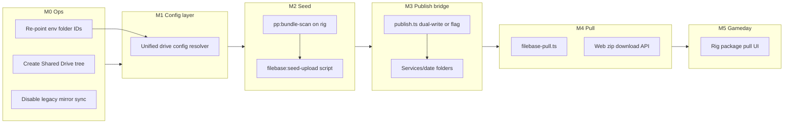

# Filebase migration & implementation plan

**Status:** Active (2026-06-15)  
**Architecture:** [filebase-architecture.md](./filebase-architecture.md)  
**Principle:** **Convert in place** — extend existing modules and env vars; do not fork a parallel Drive or sync system.

---

## The conflict you should expect

Today, three different code paths touch Google Drive with **separate env config** and **different folder semantics**:

| System | Config module | Drive folders today | New target |
|--------|---------------|---------------------|------------|
| **GRG** | `src/lib/config/grg-drive.ts` | `{root}/Get Ready Guide/Template\|Output` | Same paths under Shared drive (minimal change) |
| **Slide deck publish** | `src/lib/config/pp-drive.ts` | `{root}/ProPresenter/Playlists\|New Files` | `Services/{date}/` packages + `Filebase/` |
| **Rig apply queue** | Supabase `slide_deck_builds` | No Drive (rig writes PP locally) | Unchanged short-term; Gameday adds `Services/` pull |
| **Bundle scanner** | `PP_BUNDLE_ROOT` env | Rig-local only → `pp_index_snapshots` | Also seeds `Filebase/` on Drive |

**Legacy ops (outside Grapevine):** whole-filebase GDrive mirror — **must be disabled** before seeding; not referenced in app code.

**Risk:** Changing folder IDs breaks GRG, slide-deck publish, and rig publish in the same deploy if you big-bang rename paths. **Mitigation:** strangler migration (below).

---

## Recommended approach: strangler, not rewrite



**Rule:** Each phase leaves **last week's workflow working** until the next phase is verified.

---

## Phase M0 — Ops (no app deploy required)

**Goal:** All existing tools read/write the **new Shared drive** without code changes.

### M0.1 Create Shared drive folder tree

On Google Shared drive `{Church} — Grapevine`:

```text
Get Ready Guide/Template/
Get Ready Guide/Output/
Song Scans/
Filebase/                    ← empty until M2
Filebase/snapshots/
Services/                    ← empty until M3
```

**Migrate existing content:**

| From | To |
|------|-----|
| Current GRG template + output (personal or old shared) | `Get Ready Guide/…` (copy or move) |
| Current `church-planning-buddy/ProPresenter/Playlists` | Optional: keep as archive; **new** publishes go to `Services/` after M3 |
| Song Scans tree | `Song Scans/` |

### M0.2 Reassign env vars (all tools)

Update **Cloudflare Worker** (`npm run env:cf`) and local `.env.local`:

| Env var | Point to |
|---------|----------|
| `GRG_TEMPLATE_FOLDER_ID` | Shared drive `Get Ready Guide/Template` |
| `GRG_OUTPUT_FOLDER_ID` | Shared drive `Get Ready Guide/Output` |
| `GRG_*_FOLDER_PATH` | Update if using path walk (e.g. drop `church-planning-buddy` prefix if drive root is the shared drive) |

**ProPresenter publish vars (transitional):**

| Env var | M0–M2 | M3+ |
|---------|-------|-----|
| `PP_PLAYLISTS_FOLDER_ID` | Keep on legacy `ProPresenter/Playlists` **or** create `Services` parent | `Services` parent folder ID |
| `PP_NEW_FILES_FOLDER_ID` | `Filebase/` or legacy `New Files` | `Filebase/` for library adds |

Use existing scripts after connecting Google:

```bash
npx tsx scripts/resolve-grg-folder-ids.ts
npx tsx scripts/resolve-pp-folder-ids.ts
```

### M0.3 Verify each tool against new drive

| Tool | Smoke test |
|------|------------|
| GRG | Diagnose Drive → Apply one date |
| Slide deck | Preview → Submit (no Send required) |
| Rig | Scan now → index on web |

### M0.4 Disable legacy mirror sync

On **every** device that ran whole-filebase sync: disable startup overwrite. Document in ops runbook.

**Exit criteria:** GRG + slide-deck preview work from new Shared drive; legacy sync off.

### M0 progress (2026-06-15)

**Drive folders (reference):**

| Role | Folder ID | Notes |
|------|-----------|-------|
| **New layout** (GRG + handoff) | `1FG1w8LXfoSTQfjKZxsAv7735F0IukvMw` | Active target for tool env vars |
| **Legacy sync database** | `1-1I9HY7af_a2FCRw8WmKceAuI50DLJlg` | Read-only for `jesse.delgadillo19` — do not write; retire after M2 |

**M0 re-point runbook:** [m0-drive-repoint.md](./m0-drive-repoint.md)

| What the copy is | What it is not |
|------------------|----------------|
| GRG template/output, Song Scans, legacy `ProPresenter/Playlists` handoffs | `Filebase/Libraries/` working copy for selective pull |

**Implication:** M2 filebase seed is **deferred** and still required from the **presentation rig** (`pp:bundle-scan` → upload) when ready. Do not treat this folder as `FILEBASE_ROOT`.

**M0 can proceed without M2:**

1. Re-point `GRG_*` env vars to folders inside this copy (or reorganize GRG under `Get Ready Guide/` on Shared drive).
2. Create **empty** `Filebase/` + `Filebase/snapshots/` + `Services/` siblings (same Shared drive or new root).
3. Keep `PP_PLAYLISTS_FOLDER_ID` on legacy handoff path inside copy until M3.
4. Disable legacy whole-mirror sync on devices (still required before any future seed).

### Readiness gate for M2 (filebase seed) — not yet

Do **not** seed until all of:

| Prerequisite | Why |
|--------------|-----|
| Legacy mirror sync **disabled** on all devices | Prevents wipe/overwrite during upload |
| Rig `BundleSnapshot` taken + local backup zip | Rollback if seed goes wrong |
| Owner confirms rig library is **current** (post–new-song fixes) | Seed captures truth |
| `Filebase/` empty folder exists on Shared drive | Clear upload target |
| Ops window (~hours for large library) | Upload is one-time heavy |

Until M2: **PrezInit selective pull (M4) cannot work** — PCO preview in browser and Send-to-rig **still can** (rig local library + `pp_index_snapshots`).

## Phase M1 — Unified drive config (code, low risk)

**Goal:** One resolver for all Drive paths so M2–M5 don't touch env parsing in three places.

### New module

`src/lib/google/grapevine-drive-config.ts` (or extend `src/lib/config/`)

```ts
// Resolves all church Drive roots from env today; org row in Supabase in P2.
export type GrapevineDriveLayout = {
  sharedDriveRootId?: string;
  grg: { templateFolderId, outputFolderId, templatePath, outputPath };
  filebase: { rootFolderId, librariesPath, playlistsPath, snapshotsPath };
  services: { rootFolderId };  // Services/ parent
  // transitional:
  legacyPpPlaylistsFolderId?: string;
};
```

### Migration steps

1. Add `FILEBASE_ROOT_FOLDER_ID`, `SERVICES_ROOT_FOLDER_ID`, `SNAPSHOTS_FOLDER_ID` to `.env.local.example` (optional; path walk fallback).
2. Refactor `grg-drive-folders.ts` and `pp-drive-folders.ts` to call shared resolver (thin wrappers — **no behavior change**).
3. Add `GV_DRIVE_LAYOUT=v1` feature flag (default `legacy` until M3).

**Files touched:**

- `src/lib/config/grg-drive.ts` — add optional `GRG_DRIVE_ROOT` for Shared drive-relative paths
- `src/lib/config/pp-drive.ts` — add `SERVICES_*`, `FILEBASE_*` path segments
- `src/lib/google/pp-drive-folders.ts` — `resolveServicesRootFolderId`, `resolveFilebaseRootFolderId`
- Tests: extend `grg-drive.test.ts`, add `grapevine-drive-config.test.ts`

**Exit criteria:** All existing tests pass; GRG + publish still use same effective folder IDs.

---

## Phase M2 — Seed filebase onto GDrive

**Status:** **Deferred** — Drive copy `1FG1w8LX…` is GRG/handoff only; full `Libraries/` tree must come from rig when readiness gate passes (see M0 progress).

**Goal:** `Filebase/Libraries` + `Filebase/Playlists` populated from presentation rig.

### Use existing scanner

```bash
# On presentation rig
PP_BUNDLE_ROOT="/path/to/ProPresenter/Support Files" npm run pp:bundle-scan -- --save baseline-pre-migration
```

### New script (implement in M2)

`scripts/filebase-seed-upload.ts`:

1. Read latest `BundleSnapshot` from rig-local store or `--snapshot` path.
2. Upload files to `Filebase/` preserving `relativePath` (Libraries/**, Playlists/**).
3. Write `Filebase/snapshots/{id}.json` (metadata only).
4. **Dedup:** skip upload if sha256 already on Drive (`/blobs/sha256/` optional — PROPRESENTER-SYNC pattern).

**Do not:** upload via whole-folder Drive desktop sync.

### Conflict with existing code

- `pp:bundle-scan` and `pp:index-upload` upload **index JSON to Supabase**, not full files — seed script is **new** but reuses `bundle-sync/scanner.ts` output.
- Rig `Scan now` continues uploading `pp_index_snapshots` — filebase seed is a **one-time** (plus incremental adds later).

**Exit criteria:** Selective pull can resolve paths against `Filebase/snapshots/baseline-*.json`; spot-check 5 songs exist on Drive with matching sha256.

---

## Phase M3 — Restructure publish → `Services/{date}/`

**Goal:** Upload packages to new layout with Incomplete/Complete; keep old publish path during transition.

### Bridge strategy (avoid breaking rig publish)

| Flag | `publishSlideDeckPackage` behavior |
|------|-----------------------------------|
| `GV_DRIVE_LAYOUT=legacy` | Current: `ProPresenter/Playlists/{date}/` only |
| `GV_DRIVE_LAYOUT=dual` | Write **both** legacy Playlists **and** `Services/{date}/complete-vN/` |
| `GV_DRIVE_LAYOUT=v1` | `Services/` only |

Implement in:

- `src/lib/slide-deck/publish.ts`
- `src/lib/slide-deck/publish-instructions.ts` (promote from tabled)
- `src/lib/google/pp-drive-folders.ts` — `ensureServicePackageFolder(date, status, version)`

### Incomplete / Complete UX (P1 UI)

- New upload flow on web (or extend slide-deck publish API): prompt `[ Incomplete ]` `[ Complete ]`
- Set `submission_status` on `import-marker.json` (`publish-types.ts`)

### What stays unchanged in M3

- **Send-to-rig → Apply** pipeline (`slide_deck_builds`, `grapevine-rig-worker`) — still works for PCO-only weeks
- `run-build.ts` → `publishSlideDeckPackage` after apply — add dual-write here too

### Conflict points

| Existing | Change |
|----------|--------|
| `buildServicePackageKey` date naming | Reuse for `Services/{YYYY.MM.DD}/` |
| `service-package-key.ts` | Align with folder names |
| `PROPRESENTER-PUBLISH.md` | Document new paths; mark legacy |

**Exit criteria:** One Complete package appears under `Services/{date}/complete-v1/` with full `import-marker.json`; legacy path still works in `dual` mode.

---

## Phase M4 — Selective pull (new capability)

**Goal:** PCO plan → zip of exact filebase files for remote prep.

### New code

- `src/lib/google/filebase-pull.ts` — resolve manifest rows → `Filebase` paths via snapshot index
- `src/app/api/filebase/pull/route.ts` — authenticated; returns zip or signed download manifest
- Cross-platform zip: replace macOS-only `transport-zip.ts` with `archiver` or `fflate`

### Dependencies on M2 + M1

- Requires seeded `Filebase/` + snapshot on Drive
- Uses existing `mock-commit.ts` / `manifest.ts` — **no change to PCO pipeline**

### Does not replace yet

- Send-to-rig (optional path remains)
- Rig Gameday pull (M5)

**Exit criteria:** Given plan ID, API returns zip; sha256 manifest validates; missing song fails closed.

---

## Phase M5 — Gameday package pull on rig

**Goal:** Operator pulls `Services/{date}/final/` or latest Complete; conflict UI per architecture doc.

### Extend existing rig

- `apps/grapevine-rig/frontend/main.js` — list Complete packages; pull + conflict UI
- New worker step or script: download package from Drive → import into PP Support Files paths
- Reuse `PlaylistConflictError` + new file-level diff UI

### Operator account

- Seed `org_members` with `role = 'operator'` for rig-only login (manual SQL until P2 owner API)

**Exit criteria:** Dry-week Gameday: pull Complete package → resolve conflicts → present in PP.

---

## Phase P2+ (parallel tracks, after M3 stable)

| Track | Work |
|-------|------|
| **Owner role** | Migration `owner` on `org_members`; drive config in `organizations` table |
| **Deprecate legacy** | `GV_DRIVE_LAYOUT=v1`; remove dual-write |
| **Workflow stages** | `workflow_stage` on submissions |
| **Rig backup zip** | Post-Gameday upload to `Filebase/backups/` |

---

## File change map (what touches what)

```
src/lib/config/
  grg-drive.ts          ← M1 paths; unchanged IDs at M0
  pp-drive.ts           ← M1 add FILEBASE_*, SERVICES_*

src/lib/google/
  grg-drive-folders.ts  ← M1 thin wrapper
  pp-drive-folders.ts   ← M1 + M3 ensureServicePackageFolder
  grapevine-drive-config.ts  ← M1 NEW
  filebase-pull.ts      ← M4 NEW

src/lib/slide-deck/
  publish.ts            ← M3 dual-write
  publish-instructions.ts ← M3 promote
  publish-types.ts      ← M3 submission_status
  run-build.ts          ← M3 dual-write after apply

scripts/
  filebase-seed-upload.ts  ← M2 NEW
  resolve-*-folder-ids.ts  ← M0 ops (existing)

apps/grapevine-rig/     ← M5 Gameday pull UI

supabase/migrations/   ← P2 org drive config + owner role (not blocking M0–M3)
```

---

## What to do first (recommended order)

| Order | Who | Task | Blocks |
|-------|-----|------|--------|
| **1** | Ops | M0 Shared drive + re-point GRG env + smoke test | Everything |
| **2** | Ops | M0 disable legacy mirror sync | Seed safety |
| **3** | Dev | M1 unified drive config (no behavior change) | M2–M5 |
| **4** | Ops + Dev | M2 bundle scan + seed upload script | M4 pull |
| **5** | Dev | M3 publish dual-write + import-marker to Services | Remote upload UX |
| **6** | Dev | M4 selective pull API | Volunteer prep |
| **7** | Dev | M5 rig Gameday pull | Sunday workflow |

**Do not start with M4/M5** before M0–M2 — selective pull has nothing to pull from.

---

## Dual-path convergence (avoid confusion)

During M3–M5 both paths coexist:

| Path | When to use |
|------|-------------|
| **Browser Send-to-rig → Apply** | PCO-only week; no manual PP edit on remote device |
| **Services/ package pull** | Volunteer edited in PP; Gameday primary |

Document in ops which path your church uses each week. Deprecate Send-to-rig for presentation only after M5 proven.

---

## Testing checklist per phase

| Phase | Test |
|-------|------|
| M0 | GRG Apply from second planner (no 403); slide-deck preview |
| M1 | Unit tests; env-only integration smoke |
| M2 | 5 random library files on Drive match rig sha256 |
| M3 | Complete upload lands in `Services/`; legacy path still works in dual |
| M4 | Pull zip for one PCO plan; fail on missing song |
| M5 | Gameday pull with intentional conflict; operator resolves |

---

## Related docs

- [filebase-architecture.md](./filebase-architecture.md)
- [multi-user-ops-and-shared-drive.md](./multi-user-ops-and-shared-drive.md)
- [PROPRESENTER-PUBLISH.md](../PROPRESENTER-PUBLISH.md) (update in M3)
- [HOSTING-GRAPEVINE.md](../HOSTING-GRAPEVINE.md) (env:cf)
