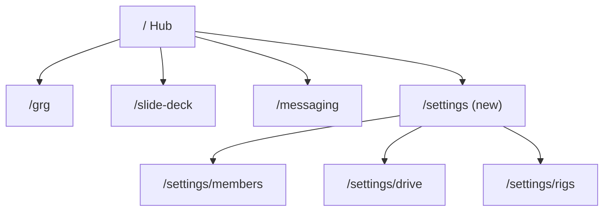

# 01 — Information architecture

**Owner:** _your name_  
**Last updated:** _date_

## Product surfaces

| Surface | Base URL / app | Primary actors |
|---------|----------------|----------------|
| Grapevine Prep (web) | `https://grapevineprep.com` | planner, admin, viewer |
| Grapevine Rig (desktop) | Tauri app | operator, admin (pairing) |

---

## Site map (target)

Edit this tree to match your intended navigation. Mark `(new)`, `(remove)`, `(rename)` as needed.

```text
/                           Hub — tool launcher
/login                      Sign in
/grg                        Get Ready Guide wizard
/slide-deck                 Slide Deck Generator
/messaging                  Team Messaging
/settings                   (new) Org settings shell
/settings/members           (new)
/settings/drive             (new) Drive layout
/settings/rigs              (new) Presentation rigs
/tasks                      (future) coming_soon in registry
/export                     (future) coming_soon in registry
```



---

## Role × navigation matrix

Fill ✓ / — / ? for each cell. Add columns if you add roles.

| Destination | planner | admin | operator | viewer | unauthenticated |
|-------------|---------|-------|----------|--------|-----------------|
| Hub `/` | | | | | |
| GRG `/grg` | | | | | |
| Slide deck `/slide-deck` | | | | | |
| Messaging `/messaging` | | | | | |
| Settings `/settings/*` | | | | | |
| Rig app (pair / apply) | | | | | |

**Notes on operator:** Can operators use web at all, or rig-only?

---

## Hub tool registry (target)

Maps to `src/lib/tools/registry.ts` when implemented.

| id | name | href | status | show on hub? | notes |
|----|------|------|--------|--------------|-------|
| grg | Get Ready Guide | /grg | active | | |
| slide-deck | Slide Deck Generator | /slide-deck | active | | |
| messaging | Team Messaging | /messaging | active | | |
| tasks | Task Manager | /tasks | coming_soon | | |
| export | Export Hub | /export | coming_soon | | |
| settings | Settings | /settings | new | | admin entry? |

---

## Open IA decisions

| # | Question | Decision |
|---|----------|----------|
| 1 | Settings: top-level hub card vs header link only? | |
| 2 | Org switcher in header (multi-org future)? | |
| 3 | Persistent sidebar vs hub-only navigation? | |
| 4 | Back-to-hub: every tool page or breadcrumb? | |
| 5 | Grapevine Rig: linked from web settings only? | |
