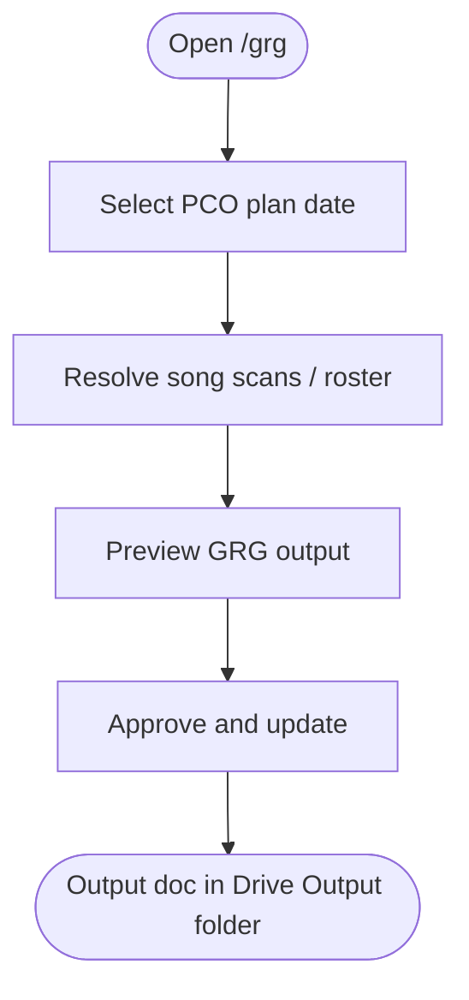

# 03 — Workflow: Get Ready Guide (GRG)

**Actor:** planner (admin)  
**Surface:** `/grg`  
**Systems:** PCO, Google Drive/Docs, Supabase (session)

---

## Happy path (edit)

Label each node when you refine:

- **Actor** · **Surface** (`grg.step.*`) · **Outcome** (what changes)

---

## Step inventory

| Step id | User label | API / action | Blockers |
|---------|------------|--------------|----------|
| `grg.step.plan` | Select plan | `POST /api/mvp/plan` | PCO token |
| `grg.step.songs` | Song scans | candidates, scan options | Google Drive |
| `grg.step.roster` | Guest / roster tags | | incomplete guests |
| `grg.step.preview` | Preview | `POST /api/mvp/preview` | |
| `grg.step.approve` | Approve and update | apply-init → apply-scan → apply-columns | template placeholders |
| `grg.step.export` | Post PDF to PCO | export-grg | optional |

---

## Branching / errors (fill in)

| Condition | UX | Next step |
|-----------|-----|-----------|
| Google not connected | | |
| GRG Drive diagnose fails | | |
| Template missing placeholders | Skip intro? | |
| Song scan not selected | | |
| Apply 400 Docs API | | |

---

## Your notes

_Replace this section with your redesigned GRG flow if it changes._
