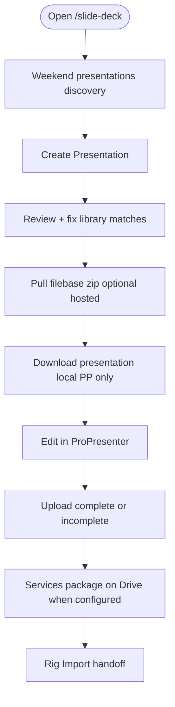
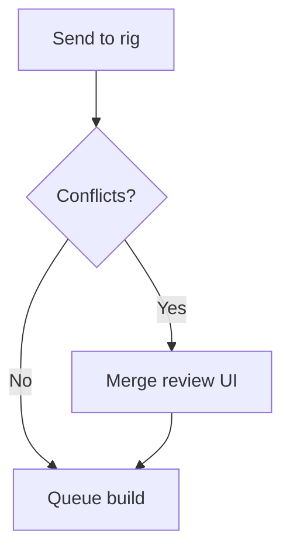

# 04 — Workflow: Slide Deck (web)

**Actor:** planner, admin  
**Surface:** `/slide-deck`  
**Systems:** PCO, Supabase (`slide_deck_submissions`, `slide_deck_builds`), org index snapshot

Cloud **does not** write to ProPresenter directly on hosted site — rig applies.

---

## Happy path (remote prep cycle)

---

## Happy path (sanctuary Send-to-rig)

---

## Step inventory

| Step id | User label | API / action | Notes |
|---------|------------|--------------|-------|
| `slide.step.discover` | Weekend presentations | `GET /api/pp/submissions?handoffsOnly=1` | complete/incomplete banners |
| `slide.step.load` | Create Presentation | `POST /api/slide-deck/mock-commit` | cloud index via orgId |
| `slide.step.library` | Pick library variant | per-row selection | |
| `slide.step.pull` | Pull filebase files | `POST /api/filebase/pull` | hosted; needs M2 seed |
| `slide.step.download` | Download presentation | `POST /api/slide-deck/apply` | local prep only |
| `slide.step.upload` | Upload complete/incomplete | `POST /api/pp/submissions` + `upload/scan` | exports .proplaylist on complete |
| `slide.step.submit` | Submit draft | `POST /api/pp/submissions` | merge lane only |
| `slide.step.send` | Send to rig | `POST /api/pp/builds` | sanctuary lane |
| `slide.step.status` | Build status poll | builds API | |

---

## Merge / submission conflicts (row-level)

When two planners edit the same `elementKey`:

---

## Publish to Drive

| Path | When | Target folder |
|------|------|---------------|
| Complete handoff upload | remote prep upload complete | `Services/{date}/complete-v1/handoff-{id}/` |
| After rig apply | `publish_after_apply` | legacy `ProPresenter/Playlists` or dual-write |
| Upload `.proplaylist` (hosted) | emergency | legacy Playlists |

Set `GV_DRIVE_LAYOUT=dual|v1` and `PP_SERVICES_FOLDER_ID` for Services layout.
