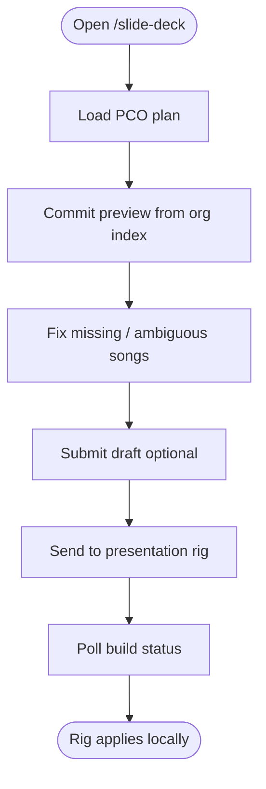
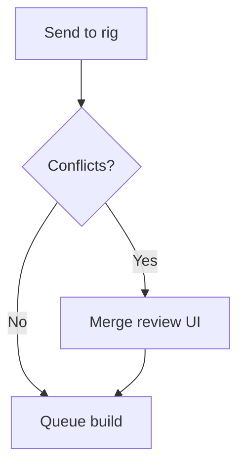

# 04 — Workflow: Slide Deck (web)

**Actor:** planner, admin  
**Surface:** `/slide-deck`  
**Systems:** PCO, Supabase (`slide_deck_submissions`, `slide_deck_builds`), org index snapshot

Cloud **does not** write to ProPresenter directly on hosted site — rig applies.

---

## Happy path (edit)

---

## Step inventory

| Step id | User label | API / action | Notes |
|---------|------------|--------------|-------|
| `slide.step.load` | Load plan | plan + mock-commit | index freshness banner |
| `slide.step.library` | Pick library variant | per-row selection | |
| `slide.step.submit` | Submit draft | `POST /api/pp/submissions` | optional |
| `slide.step.merge` | Merge review | merge UI if conflicts | |
| `slide.step.send` | Send to rig | `POST /api/pp/builds` | |
| `slide.step.status` | Build status poll | builds API | |

---

## Merge / submission conflicts (row-level)

When two planners edit the same `elementKey`:

Describe your **target** merge UX:

---

## Local ProPresenter apply (dev Mac only)

Separate path when PP is on same machine — document if you keep, hide, or remove:

| Step | Current | Target |
|------|---------|--------|
| Preflight conflict | `/api/slide-deck/apply/preflight` | |
| Overwrite / Cancel | web buttons | add Keep both? |

---

## Publish to Drive (web / rig)

| Path | When | Target folder (M0 vs M3) |
|------|------|--------------------------|
| After rig apply | `publish_after_apply` | `ProPresenter/Playlists` → future `Services/` |
| Upload `.proplaylist` (Option C) | emergency | |

---

## Your redesign notes

_Plan format changes, Holy Forever disambiguation, new steps — describe here._
