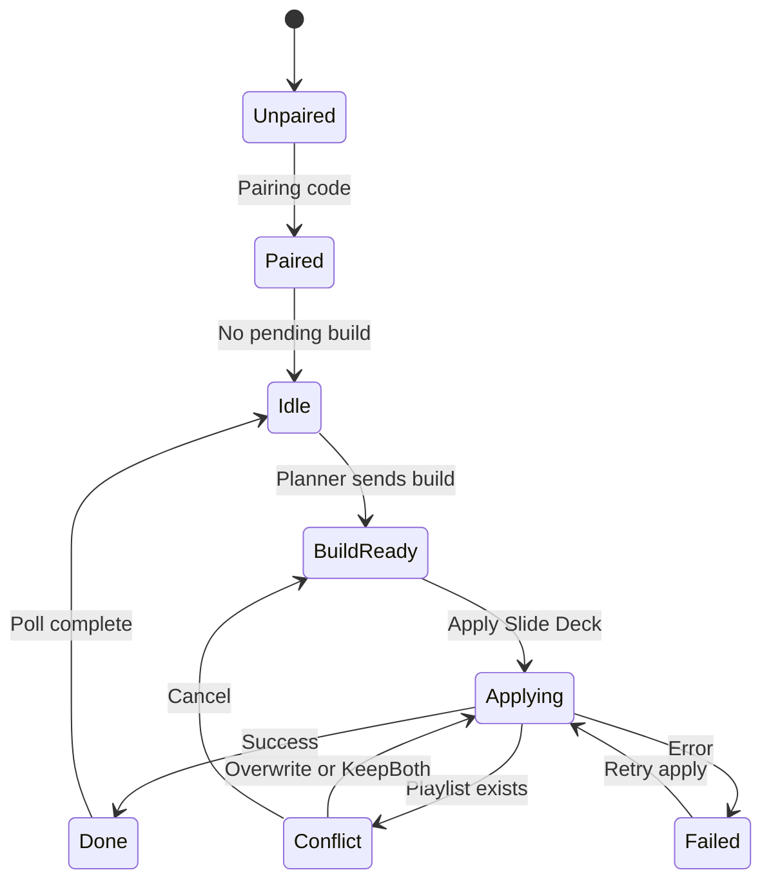
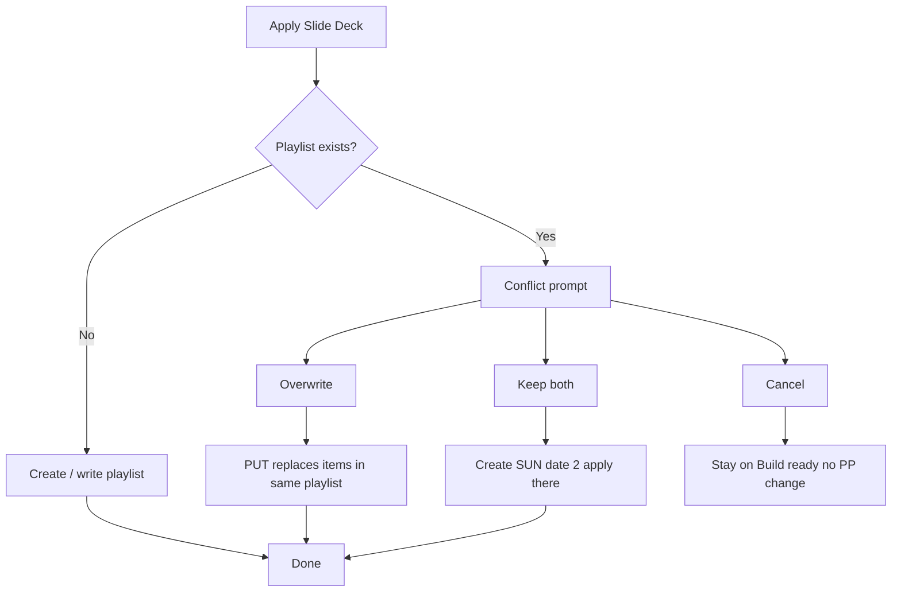

# 05 — Workflow: Grapevine Rig (operator)

**Actor:** operator (admin for pairing)  
**Surface:** Grapevine Rig Tauri app  
**Systems:** ProPresenter local API, grapevineprep.com APIs, optional Drive publish

---

## Lifecycle overview (edit)

---

## Operator flows (detail each)

### Pairing (admin generates code on web)

| Step id | Action | API |
|---------|--------|-----|
| `rig.step.pair` | Enter code + display name | pair endpoint |

### Scan index

| Step id | Action | Outcome |
|---------|--------|---------|
| `rig.step.scan` | Scan now | `pp_index_snapshots` updated |

### Apply build

| Step id | Action | Outcome |
|---------|--------|---------|
| `rig.step.review` | Implementation plan review | optional row overrides |
| `rig.step.apply` | Apply Slide Deck | PP playlist written |
| `rig.step.publish` | Drive publish after apply | optional |

---

## Playlist conflict (example — replace with your design)

**Trigger:** Target playlist name already exists with items in ProPresenter.

**Current pain:** Message says Overwrite; button may not pass resolution to worker.

**Target UX (fill in your final copy and buttons):**

| Button | User intent | PP behavior | Playlist name |
|--------|-------------|-------------|---------------|
| Overwrite | Replace Sunday list | Reuse id, replace items | unchanged |
| Keep both | Keep old + add new | New playlist | e.g. `SUN 2026.06.15 (2)` |
| Cancel | Do nothing | No write | — |

**Screen id:** `rig.conflict.playlist_exists` (see screen inventory)

---

## ProPresenter settings (in-app)

| Field | Purpose |
|-------|---------|
| TCP port | PP network API |
| Transport | tcp / auto / http |

---

## Failure / retry

| State | UI | Operator action |
|-------|-----|-----------------|
| `failed` build | Error message + Retry apply | |
| PP not reachable | | fix port / PP running |
| Missing library song | | Scan now + planner refresh |

---

## Your overhaul notes

_Describe full rig UX redesign: layout, steps, conflict, publish, notifications._
