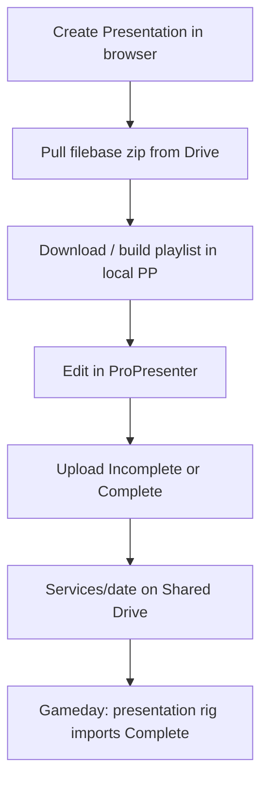

# 06 — Workflow: Remote prep

**Status:** Implemented (web UX + Services publish + rig handoff import)  
**Refs:** [filebase-architecture.md](../filebase-architecture.md), [filebase-migration-plan.md](../filebase-migration-plan.md)

---

## Actor

Remote volunteer with ProPresenter (not presentation rig).

---

## Approved flow: pull-then-build

Volunteers need ProPresenter on their device. Assembly happens **on the prep machine**, not in the browser or on the sanctuary rig.

### Operator steps

1. **Create Presentation** on grapevineprep.com (or local dev with org auth) — uses cloud filebase index.
2. **Pull filebase files** (hosted) or ensure library files exist locally (interim).
3. On prep machine with `PP_ALLOW_WRITES=true`: **Download presentation** into local ProPresenter.
4. Edit → **Open upload tool** → tag **Upload complete** or **Upload incomplete**.
5. Complete uploads export `.proplaylist` and publish to `Services/` when Google + `GV_DRIVE_LAYOUT` are configured.
6. Presentation rig **Import handoff** downloads package and stages playlist for File → Import.

**Not** sanctuary apply — use **Send to presentation rig** from the browser for Sunday PCO-driven apply on the presentation rig.

---

## Decisions

| # | Question | Decision |
|---|----------|----------|
| 1 | Build before download vs pull-then-build? | **Pull-then-build** — `POST /api/filebase/pull` after M2 seed |
| 2 | Relationship to Send-to-rig? | Send-to-rig = **sanctuary only**; Download = **prep device only** |
| 3 | Who can mark Complete? | Planner/admin with local PP + matching playlist |
| 4 | Browser-only without local PP? | Pull filebase zip + wait for existing Complete handoff download |

---

## M2 / M4 dependency

Selective pull requires **M2**: `npm run filebase:seed-upload` on the presentation rig populates `Filebase/` on Shared Drive.

Verify: `npm run handoff:verify-migration` and `npx tsx scripts/verify-m0-drive-ids.ts`.
