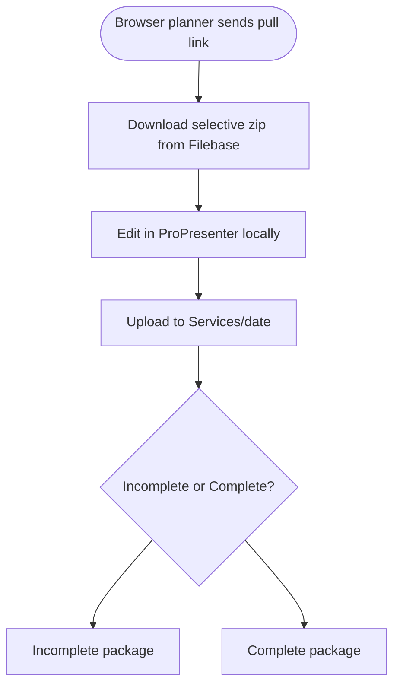

# 06 — Workflow: Remote prep (future)

**Status:** Stub — fill when filebase pull + `Services/` upload UX is designed  
**Refs:** [filebase-architecture.md](../filebase-architecture.md), M4/M5 migration

---

## Actor

Remote volunteer with ProPresenter (not presentation rig).

---

## Target flow (sketch — replace)

---

## Open questions

| # | Question | Decision |
|---|----------|----------|
| 1 | Browser-only vs desktop helper for upload? | |
| 2 | Who can mark Complete? | |
| 3 | Relationship to slide-deck Send-to-rig? | |

---

## Your notes
