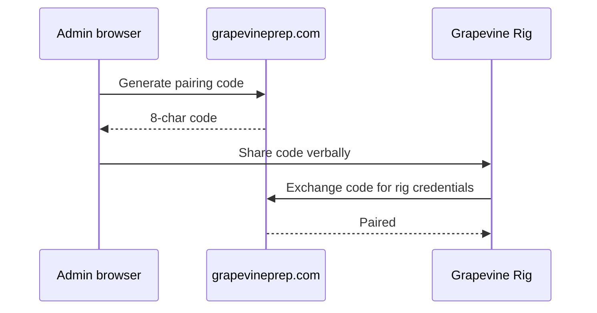

# 07 — Workflow: Admin

**Actor:** `org_members.role = admin`

---

## Admin capabilities (inventory)

| Capability | Current UI | Target UI | API |
|------------|------------|-----------|-----|
| Pair presentation rig | slide-deck rig admin panel | `/settings/rigs`? | pairing-codes |
| Manage members | none | `/settings/members`? | TBD |
| Configure Drive folders | env / terminal | `/settings/drive`? | deferred plan |
| View audit / builds | web build status | | |

---

## Rig pairing flow (edit)

---

## Settings: Drive layout (deferred)

Link decisions to [org-drive-settings-ui.md](../org-drive-settings-ui.md):

- Paste folder links vs browse tree
- Validate on save
- Who can edit

---

## Your notes

_Auth structuring: invite flow, revoke, role changes._
